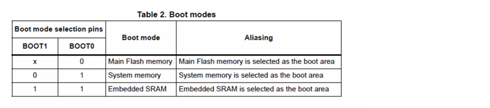

## ARM Cortex Mx custom bootloader development for STM32Fx MCUs     
     
		 
Bootloader is small piece of code stored in the MCU flash or ROM to act as an application loader as well as a mechanism to update the applications whenever required. It is the first thing runs after microcontroller reset. It also helps to Download/Upload binaries (code)	from Host to microcontroller (IAP) when we flash a program to microcontroller.	 
    
- You sometime activate (upon MCU reset) the bootloader on some microcontrollers by changing the status of boot pins   
     
- Microcontrollers like NUCLEO/STM32 has In-Circuit Debugger/Programmer (ICDP), a circuitary, attached to them. Hence we don't take the help of bootloader rather use ICDP also known as ST link (for ST MCUs) to program (In System Programming ISP) the microcontroller. Whereas in Arduinos this circuitary is simply not there and it takes the help of bootloader to progam (IAP) the Arduino.		  	
     
		 
## STM32F446xx Memory organisation     
      
- Internal Flash memory also called Embedded Flash memory of 512kb.    
- Internal SRAM1 of 112kb.    
- Internal SRAM2 of 16kb.    
- System memory (ROM) of 30kb.    
- OTP memory of 528 bytes.     
- Option bytes memory of 16bytes.    
- Backup RAM of 4kb.				
     
		 
		 
## Internal Flash memory     
      
- Size if 512kb.    
- Begins @ 0x0800 0000    
- Ends @ 0x0807 FFFF   
- Used to store your application code and read only data of the program (i.e. Vector table)    
- Non volatile       
      
			
			
## Internal SRAM1   
      
- Size is 112kb   
- Begins @ 0x2000 0000   
- Ends @ 0x2001 BFFF   
- Used to store your application global data, static variables    
- Also used for Stack and Heap purpose    
- Volatile    
- You can also execute code from this memory     
      
			
			
## Internal SRAM2   
      
- Size is 16kb   
- Begins @ 0x2001 C000   
- Ends @ 0x2001 FFFF   
- Used to store your application global data, static variables    
- Also used for Stack and Heap purpose    
- Volatile    
- You can also execute code from this memory    
      
			
			
## System Memory (ROM)   
      
- Size is 30kb   
- Begins @ 0x1FFF C000   
- Ends @ 0x1FFF 77FF   
- All the ST MCUs store the Bootloader in this memory   
- This memory is Read only.   
- By default MCU will not execute any code from this memory but you can configure MCU to boot or execute bootloader from this memory.           
    
     
    
		
		
## Reset sequence of the Cortex M Processor      
     
- When you reset the processor (press reset button on your microcontroller), The PC (program counter register) is first loaded with the value 0x0000_0000
- Then processor read the _value_ @ memory location 0x0000_0000 in to the MSP (Main Stack Pointer register)
- That means, processor first initialises the Stack pointer
- After that processor read the value @ memory location 0x0000_0004 in to the PC, that value actually contains the address of reset handler and PC jumps to the reset handler
- A reset handler is just a C or assembly function written by you to carry out any initialisations required
- From reset handler you call your main() function of the application		 		         
    
   		       
    
		
		
## Memory aliasing      
       
   		         
      
Memory aliasing is a technique used by the microcontroller manufacturer to map different addresses onto different other addresses.   
    
   
     
For example, in the image shown above, by default the base address of the user flash 0x0800_0000 is mapped onto the base address of the memory map 0x0000_0000. Hence, if you read 0th address 0x0000_0000 then that address somehow converted to the 0x0800_0000 address.   
     
Similarly, if you read 0x0000_0004 address then you will end up reading 0x0800_0000. That's because, memory region 0x0800_xxxx is mapped onto 0x0000_xxxx memory regions, Thats what we call Memory aliasing.           
    
		
		
## Boot configuration of STM32F446xx    
       
     
     
		 
     
	 		 		   
     
	 		 		   
     
	 		 		   
    
		

				 	
