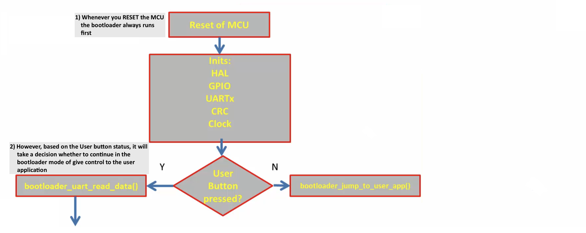

## USART Modules 
    
* _UART2_ of STM32's peripheral of the microcontroller to receive the commands which is sent by the Host, as well as replies that bootloader sends to the PC `#define C_UART     &huart2` (We make use of the virtual COM port, **PA2** and **PA3** pins of NUCLEO) (to use with Desktop Application to get the Debug messages). [Nucleo F466re User Guide: page 25, 6.8 USART communication](https://www.st.com/resource/en/user_manual/um1724-stm32-nucleo64-boards-mb1136-stmicroelectronics.pdf)     
    
* _UART3_ of STM32's peripheral as a Debug port to get the debug prints `#define D_UART     &huart3` from the bootloader. As, in the early development stage we can put some print statements `printmsg()` in our code to see what is happening under the hood when different functions is being called (Unidirectional flow from Bootloader to PC only).	Off course we need the USB to UART converter (USB-TTL) hardware to push the data to PC from the Nucleo board. (**During custom bootloader development we will only use USART2**) 		   
     
   	
     
     
## Bootloader code flow chart     
     
    
     
		 		 		 
		 
     