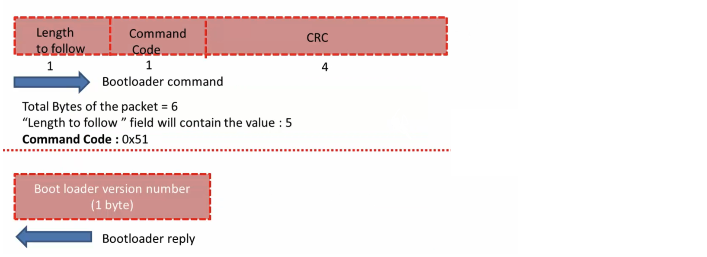

## USART Modules 
    
* _UART2_ of STM32's peripheral of the microcontroller to receive the commands which is sent by the Host, as well as replies that bootloader sends to the PC `#define C_UART     &huart2` (We make use of the virtual COM port, **PA2** and **PA3** pins of NUCLEO) (to use with Desktop Application to get the Debug messages). [Nucleo F466re User Guide: page 25, 6.8 USART communication](https://www.st.com/resource/en/user_manual/um1724-stm32-nucleo64-boards-mb1136-stmicroelectronics.pdf)     
    
* _UART3_ of STM32's peripheral as a Debug port to get the debug prints `#define D_UART     &huart3` from the bootloader. As, in the early development stage we can put some print statements `printmsg()` in our code to see what is happening under the hood when different functions is being called (Unidirectional flow from Bootloader to PC only).	Off course we need the USB to UART converter (USB-TTL) hardware to push the data to PC from the Nucleo board. (**During custom bootloader development we will only use USART2**) 		   
     
   	
     
     
## Bootloader code flow chart     
     
  
     
When the User button **isn't** pressed during RESET of MCU, the `bootloader_jump_to_user_app()` will be called and it will make a jump to User application (project name `user_app_stm32f446re`).  		
     
     
## Vector table relocation feature (ARM Cortex Mx processor)    
    
Let's discuss about the vector table relocation feature of the ARM Cortex Mx Processor.    
    
We have Flash memory with starting address 0x0800_0000 and 2 of its Sectors contains Bootloader along with its Vector table. We have another Vector table for User app starting from 0x0800_8000 as well as User app.		
    
Now, once the bootloader runs (on MCU Reset), and if the User button isn't pressed during power up, then bootloader will give control to the User application (By calling Reset Handler of User application). That's how User application gets triggered.				  
     
     
    
Once User application starts running and User application wants to handle any interrupt, as ARM Cortex Mx processor by default look for Vector table at 0x0000_0000 (Memory alias to 0x0800_0000). However, There's no  Vector table for User application, rather a Vector table for Bootloader.	
     
		 
**VTOR**      
     
Hence, at the start of User application you have to inform the ARM Controller that Vector table of User application is at 0x0800_8000 using one of the register of the ARM controller **VTOR (Vector Table Relocation Register)** and VTOR has value of 0 by default. You suppose to change the content of this register (put base address of sector 2 i.e. 0x0800_8000) when the control jump to the User application in the Reset Handler.	
      
 					
      
 					
      
 									
      
 					
      
 					
      
 					
      
 					
      
 					
      
 					
      
 					
		
		
		
		
		
		
		
		
		
		
     
		    
     
		    
     
		 		 		 
		 
     