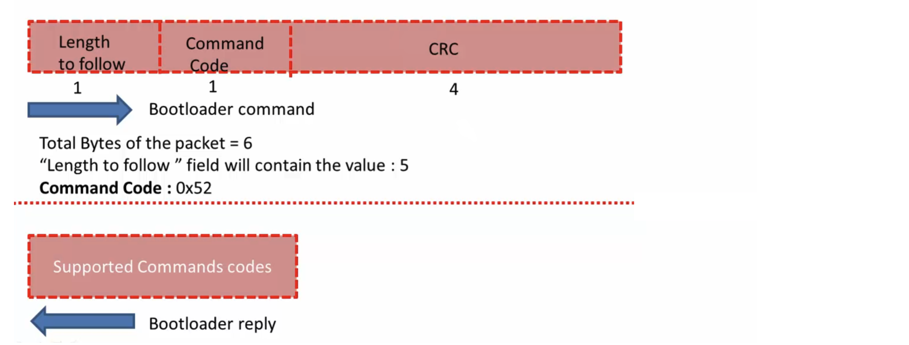
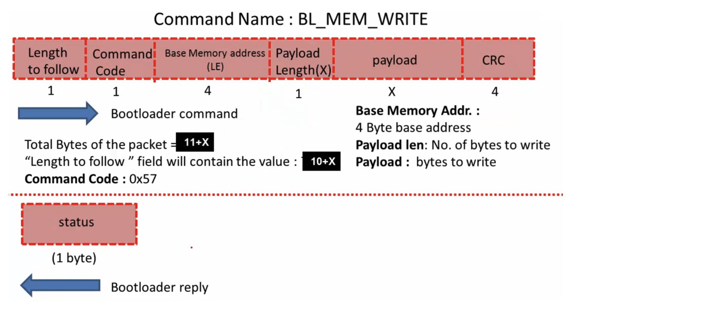

## USART Modules 
    
* _UART2_ of STM32's peripheral of the microcontroller to receive the commands which is sent by the Host, as well as replies that bootloader sends to the PC `#define C_UART     &huart2` (We make use of the virtual COM port, **PA2** and **PA3** pins of NUCLEO) (to use with Desktop Application to get the Debug messages). [Nucleo F466re User Guide: page 25, 6.8 USART communication](https://www.st.com/resource/en/user_manual/um1724-stm32-nucleo64-boards-mb1136-stmicroelectronics.pdf)     
    
* _UART3_ of STM32's peripheral as a Debug port to get the debug prints `#define D_UART     &huart3` from the bootloader. As, in the early development stage we can put some print statements `printmsg()` in our code to see what is happening under the hood when different functions is being called (Unidirectional flow from Bootloader to PC only).	Off course we need the USB to UART converter (USB-TTL) hardware to push the data to PC from the Nucleo board. (**During custom bootloader development we will only use USART2**) 		   
     
   	
     
```c
// prints formatted string to console over UART
void printmsg(char* format, ...)
{
#ifdef BL_DEBUG_MSG_EN

  char str[80];

  // extract the argument list using VA apis
  va_list args;
  va_start(args, format);
  vsprintf(str, format, args);
  HAL_UART_Transmit(D_UART, (uint8_t*)str, strlen(str), HAL_MAX_DELAY);
  va_end(args);

#endif
}
```		 
     
     
## Bootloader code flow chart     
     
 

 
     
When the User button **isn't** pressed during RESET of MCU, the `bootloader_jump_to_user_app()` will be called and it will make a jump to User application (project name `user_app_stm32f446re`).  		
     
		 
### bootloader_jump_to_user_app(void)    
    
```c
/**
 * Jump to User application, Here we are assuming
 * FLASH_SECTOR2_BASE_ADDRESS is where the User
 * application stored.
 */
void bootloader_jump_to_user_app(void)
{
  // function pointer to hold the address of Reset Handler of User app.
  void (*app_reset_handler)(void);

  printmsg("BL_DEBUG_MSG: bootloader_jump_to_user_app\n");

  //1. configure the MSP by reading the value from the base address of Sector 2
  uint32_t msp_value = *(volatile uint32_t*)FLASH_SECTOR2_BASE_ADDRESS;
  printmsg("BL_DEBUG_MSG: MSP value: %#x\n", msp_value);

  // CMSIS function
  __set_MSP(msp_value);

//  SCB->VTOR = FLASH_SECTOR1_BASE_ADDRESS;

  //2. Now fetch the reset handler address of the User application
  //   from the location FLASH_SECTOR2_BASE_ADDRESS+4
  uint32_t resethandler_address = *(volatile uint32_t*)(FLASH_SECTOR2_BASE_ADDRESS + 4);
  app_reset_handler = (void*)resethandler_address;

  printmsg("BL_DEBUG_MSG: app reset handler address: %#x\n", app_reset_handler);

  //3. jump to reset handler of the user application
  app_reset_handler();
}
```				 
     
     
## Vector table relocation feature (ARM Cortex Mx processor)    
    
Let's discuss about the vector table relocation feature of the ARM Cortex Mx Processor.    
    
We have Flash memory with starting address 0x0800_0000 and 2 of its Sectors contains Bootloader along with its Vector table. We have another Vector table for User app starting from 0x0800_8000 as well as User app.		
    
Now, once the bootloader runs (on MCU Reset), and if the User button isn't pressed during power up, then bootloader will give control to the User application (By calling Reset Handler of User application). That's how User application gets triggered.				  
     
     
    
Once User application starts running and User application wants to handle any interrupt, as ARM Cortex Mx processor by default look for Vector table at 0x0000_0000 (Memory alias to 0x0800_0000). However, There's no  Vector table for User application, rather a Vector table for Bootloader.	
     
		 
**VTOR**      
     
Hence, at the start of User application you have to inform the ARM Controller that Vector table of User application is at 0x0800_8000 using one of the register of the ARM controller **VTOR (Vector Table Relocation Register)** and VTOR has value of 0 by default. You suppose to change the content of this register (put base address of sector 2 i.e. 0x0800_8000) when the control jump to the User application in the Reset Handler.	
		 
		 
		 
### bootloader_uart_read_data(void)    
     
We have Rx buffer `uint8_t bl_rx_buffer[200]` of 200 bytes to keep the receive data. First element of `bl_rx_buffer[0]` will always be the **length** information to follow and Second element bl_rx_buffer[1] will be the **command code** to try in `swtich(bl_rx_buffer[1])` to execute right function handle.

```c
void bootloader_uart_read_data(void)
{
  uint8_t rcv_len = 0;

  while (1)
  {
	memset(bl_rx_buffer, 0, 200);

	// here we will read and decode the commands coming from Host
	//
	// first read only one byte from the host, which is the "length"
	// field of the command packet
	HAL_UART_Receive(C_UART, bl_rx_buffer, 1, HAL_MAX_DELAY);
	
	rcv_len = bl_rx_buffer[0];
	
	HAL_UART_Receive(C_UART, &bl_rx_buffer[1], rcv_len, HAL_MAX_DELAY);

	switch (bl_rx_buffer[1])
	{
	case BL_GET_VER:
	  bootloader_handle_getver_cmd(bl_rx_buffer);
	  break;
	case BL_GET_HELP:
	  bootloader_handle_gethelp_cmd(bl_rx_buffer);
	  break;
	case BL_GET_CID:
	  bootloader_handle_getcid_cmd(bl_rx_buffer);
	  break;
	
	...
	
	case BL_OTP_READ:
		bootloader_handle_read_otp(bl_rx_buffer);
		break;
	default:
	  printmsg("BL_DEBUG_MSG: Invalid command code received from host\n");
		break;
	}
 }
}	
```
      
 					
      
 					
      
 									
      
 					
      
 					
      
 					
      
 					
      
 					
      
 					
      
 					
		
		
		
		
		
		
		
		
		
		
     
		    
     
		    
     
		 		 		 
		 
     