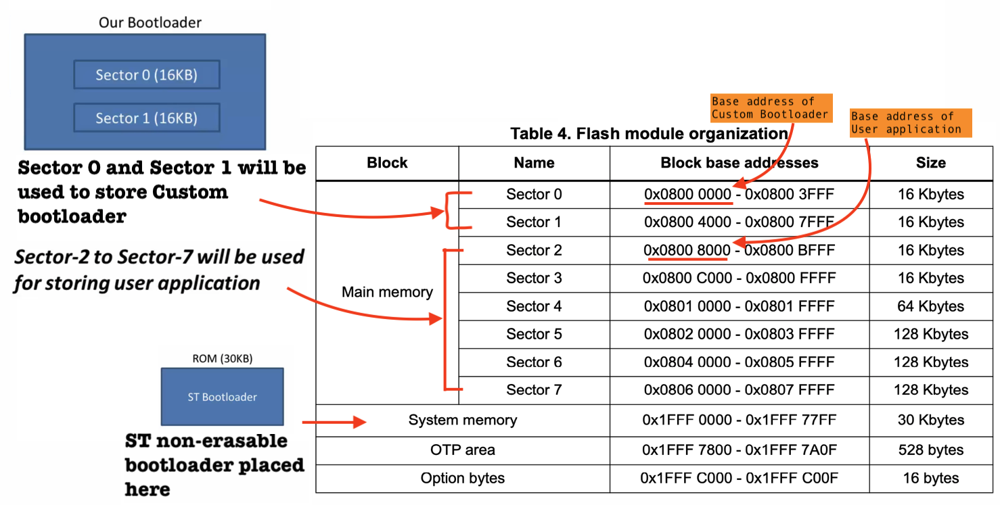
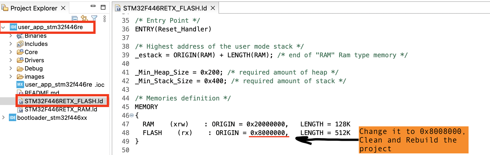
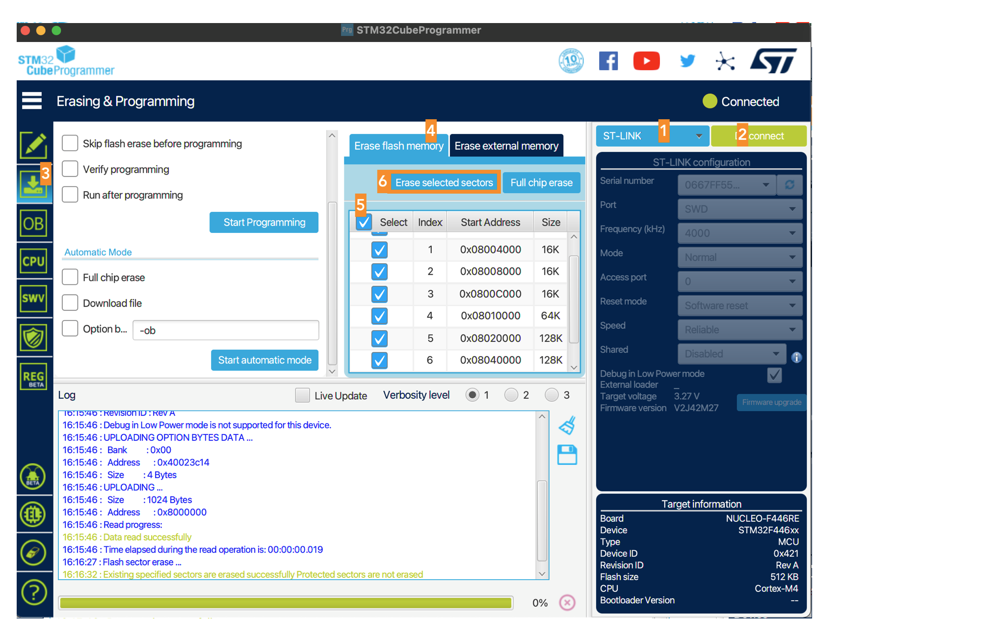
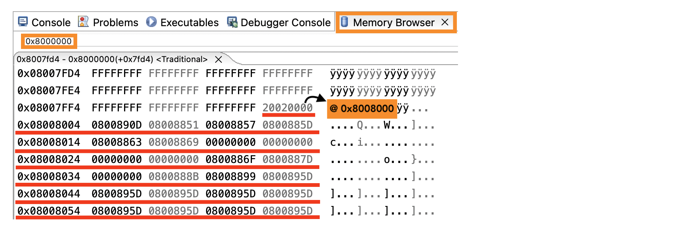

## User application 
    
When the User button **isn't** pressed during the RESET of MCU (while running `bootloader_stm32f446xx`). It will make a jump to this User application.    
    
We also enable the UART peripheral (USART2) in this User application `user_app_stm32f446re`, which prints to the console that the _User application is running..._. This ensures that `bootloader_stm32f446xx` passed the control to the User application. 	 
    
**PA5** `LD2 [Green Led]` and **PC13** `B1 [Blue PushButton]`	is already enabled. However we will enable the `EXTI line[15:10] interrupts` at _System Code > NVIC > NVIC_ and code generation at _System Code > NVIC > Code generation_ in CubeMX settings and finally generate the code.     
      
When **PC13** `B1 [Blue PushButton]` is pressed, let's toggle an 	**PA5** `LD2 [Green Led]` in Interrupt handler   
    
```
uint8_t flag=0;

void EXTI15_10_IRQHandler(void)
{
  HAL_GPIO_WritePin(LD2_GPIO_Port, LD2_Pin, !flag);
  flag = !flag;

  HAL_GPIO_EXTI_IRQHandler(B1_Pin);
}
```		
     
And finally print `char userdata[] = "Hello from User application \r\n"` in the `main()` function as follows:     
    
```
while (1)
{
  HAL_UART_Transmit(&huart2, (uint8_t*)userdata, sizeof(userdata), HAL_MAX_DELAY);
  uint32_t current_tick = HAL_GetTick();
  while (HAL_GetTick() <= current_tick + 1000);
}
```				 	
    
As User application should go to **Sector 2** onward in the Main memory as shown below     
    
  	
     
## Temporary steps   
    
Below are the temporary steps to demonstrate the code placement from `0x8008000` and these steps can be omitted  
    
1. The linker file `STM32F446RETX_FLASH.ld` is used by the linker to understand the code placement onto the User flash memory (Main memory 512Kb with 7 Sectors). Hence linker will find out through this file (`STM32F446RETX_FLASH.ld`) the **start** and **end** address of the various memories of the microcontroller and other relevant details will be fetched from this file. We would change the address from `0x80000000` to the base address where User application supposed to be placed (i.e. `0x8008000`) inside **user_app_stm32f446re > STM32F446RETX_FLASH.ld**			   
    
    
    
> [!NOTE]   
> Whenever you change the linker script (.ld file) you will have to clean and rebuild the project			
   
2. Now erase the Chip from Sector 0 to 7 with STM32CubeProgrammer and finally disconnect the connection.   
     
    
     
3. Now upload the code `user_app_stm32f446re` on to the board from IDE. (Don't forget to clean and rebuild the project after linker script being changed)		
   
4. To confirm as it has certainly been placed at the base address `0x8008000`. Run the `user_app_stm32f446re` in the Debug mode and check the **Memory Browser** by writing `0x8000000` and scroll down as shown below.  
     
     
     
> [!NOTE]	
> If you remove the debugger and press Reset, the MCU will halt at the 0x0800_**0000** address since no code is present in this region.     
> However, If you run this app in Debug mode, the gdb debugger flashes the code at 0x0800_**8000** and point the PC (Program Counter register) to this region straight away.	  
    
		
    
		
   
	  	    		 
    
			 
    

   
	 		
    			 		 
		 
     